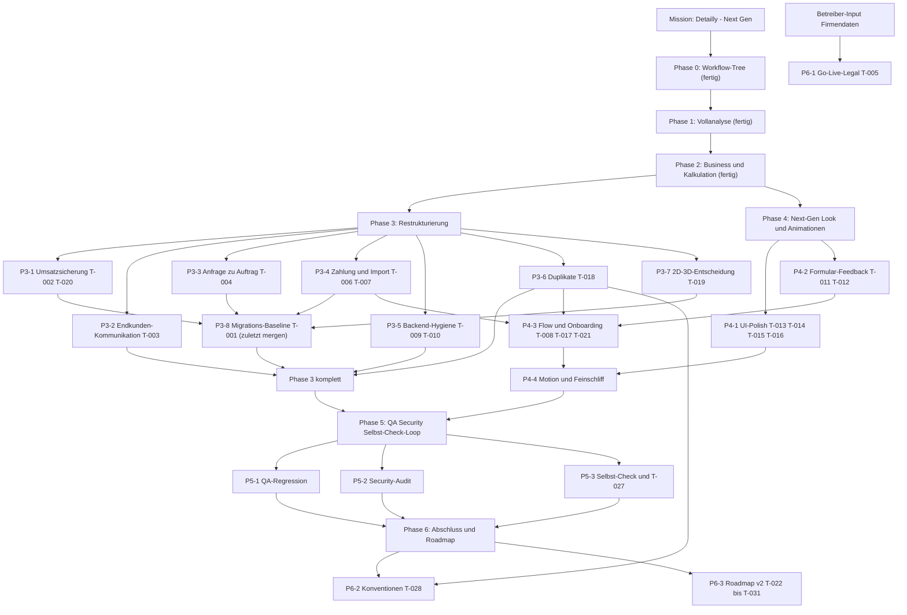

# WORKFLOW – Mission „Detailly → Next Gen (Full Company Mode)"

Stand: 2026-07-02 · Lebendes Steuerungsdokument · Quellen: `AUDIT.md`, `BACKLOG.md`, `BUSINESS_CASE.md`
**Pflege:** Nach jedem abgeschlossenen Arbeitspaket wird dieser Tree aktualisiert (Status ⏳ → 🔄 → ✅).

---

## Projektziel (Root)

**Detailly von „funktionierendes internes Werkzeug" zu einem verkaufsfähigen Next-Gen-SaaS-Produkt
auf Weltklasse-Niveau heben:** Umsatzsicherung (Plan-Gates), durchgängige Kern-Flows,
Endkunden-Touchpoints, Premium-Look mit Animationen, abgesichert durch QA/Security-Loop —
auslieferbar per Migrations-Baseline.

## Phasen-Baum

```
Detailly → Next Gen (Full Company Mode)
│
├─ Phase 0 · Workflow-Tree                    ✅  (dieses Dokument)
├─ Phase 1 · Vollanalyse                      ✅  AUDIT.md + BACKLOG.md
├─ Phase 2 · Business & Kalkulation           ✅  BUSINESS_CASE.md
├─ Phase 3 · Restrukturierung                 ⏳  (Pakete P3-1 … P3-8)
├─ Phase 4 · Next-Gen Look & Animationen      ⏳  (Pakete P4-1 … P4-4)
├─ Phase 5 · QA/Security/Selbst-Check-Loop    ⏳  (Pakete P5-1 … P5-3)
└─ Phase 6 · Abschluss & Roadmap              ⏳  (Pakete P6-1 … P6-3)
```

---

## Phase 3 · Restrukturierung ⏳

Backend-Fundament, Umsatzsicherung, Kern-Flows und Entdopplung. 🔴-Tickets zuerst.

| Paket | Inhalt | Tickets | Agent | Status |
|---|---|---|---|---|
| **P3-1 Umsatzsicherung** | Plan-Limits/Feature-Gates durchsetzen + Abo-Sperre fail-open schließen (gleicher Code-Pfad) | 🔴 T-002 · 🟡 T-020 | backend-dev (Konzept: architect, Review: security-auditor) | 🔄 PR #102 |
| **P3-2 Endkunden-Kommunikation** | Statusmails automatisch: Track-Link-Versand, „abholbereit", Terminbestätigung | 🔴 T-003 | backend-dev | ⏳ |
| **P3-3 Anfrage → Auftrag** | „Annehmen" übernimmt Leistung/Fahrzeug/Kunde in einen Auftrag (statt 12–16 Klicks) | 🔴 T-004 | backend-dev + frontend-dev | ⏳ |
| **P3-4 Zahlung & Datenimport** | „Jetzt bezahlen" auf `/rechnung?t=` (Stripe Payment Link) + CSV-Import Kunden/Fahrzeuge | 🟡 T-006 · 🟡 T-007 | backend-dev (+ frontend-dev für Import-UI) | ⏳ |
| **P3-5 Backend-Hygiene** | Fehlende Paginierung + Standorte-Speicher-Auswertung + Pagination-Clamp vereinheitlichen (Customers-Bug) | 🟡 T-009 · 🟡 T-010 | backend-dev (Test: qa-tester) | ⏳ |
| **P3-6 Duplikate konsolidieren** | Public-Shell, Token-Helper, Labels, KPI-Kachel, Rollen-Arrays zentralisieren | 🟡 T-018 | frontend-dev + backend-dev (Schnitt: architect) | ⏳ |
| **P3-7 2D/3D-Entscheidung** | Doppelstruktur Fahrzeugannahme (2D) vs. Schadenserfassung (3D) auflösen — erst Konzept, dann Code | 🟡 T-019 | architect + ux-designer, danach frontend-dev/backend-dev | ⏳ |
| **P3-8 Migrations-Baseline** | DB-Baseline generieren — **als LETZTES Paket der Phase mergen** | 🔴 T-001 | backend-dev (Review: architect) | ⏳ |

**Erkenntnisse aus P3-1 (PR #102):** Starter-Tarif enthält jetzt `mitarbeiter`+`standorte`
(Differenzierung über Limits 5/1 vs. 25/5); Fehler-Kontrakt `PLAN_FEATURE_MISSING`/
`PLAN_LIMIT_REACHED` steht — Frontend-Anbindung (`ApiError.code` durchreichen) in P4-2
einplanen; Perf-Memoisierung der Plan-Loads nach P3-5 verschoben; T-001-Deploy braucht
Abo-Backfill für Alt-Tenants ohne Abo-Datensatz.

**Abhängigkeiten Phase 3:**
- **P3-8 (T-001) wird von allen schema-ändernden Paketen blockiert:** P3-1 (T-002), P3-3 (T-004), P3-4 (T-006), P3-7 (T-019) müssen vorher gemergt sein (vgl. Memory „Dev-Spalten ohne Prod-Migration").
- P3-6 (T-018) blockiert P4-3 (T-008/T-017) — erst entdoppeln, sonst wachsen neue Kopien.
- P3-4 (T-007) blockiert P4-3 (T-008: Import ist Checklisten-Schritt).
- T-020 hängt an T-002 (gleicher Code-Pfad) → deshalb ein Paket P3-1.
- T-010 mit T-009 in einem Zug (gleiche Baustelle) → deshalb ein Paket P3-5.

## Phase 4 · Next-Gen Look & Animationen ⏳

Sichtbarer Premium-Sprung: Polish, Feedback-System, Flow-Verbesserungen, Motion-Design.

| Paket | Inhalt | Tickets | Agent | Status |
|---|---|---|---|---|
| **P4-1 UI-Polish-Bündel** | Plantafel-Loading + Empty/Loading-Lücken · Umlaut-Textfehler · Theming-Brüche (3D-Szene, Grid Hell-Thema) · Mobile-Modal-Grids | 🟡 T-013 · 🟡 T-014 · 🟡 T-015 · 🟡 T-016 | frontend-dev | ⏳ |
| **P4-2 Formular-Feedback & Dialoge** | Pflichtfeld-Standard, Inline-Fehler, Toasts · `window.confirm` → Modal + DSGVO-Löschung absichern | 🟡 T-011 · 🟡 T-012 | ux-designer (Standard) + frontend-dev | ⏳ |
| **P4-3 Flow & Onboarding** | Inline-Kundenanlage + Aktionen in Kundenakte · Suche/Filter Aufträge/Fahrzeuge · Onboarding-Checkliste + Empty-CTAs | 🟡 T-017 · 🟡 T-021 · 🟡 T-008 | frontend-dev (Flows/Konzept: ux-designer) | ⏳ |
| **P4-4 Next-Gen Motion & Feinschliff** | Animationen/Mikro-Interaktionen auf Weltklasse-Standard (Design-Standard-Memory); Typografie-Drift aus AUDIT §3.3 glätten — kein eigenes Ticket, Abnahme gegen Design-Standard | — | ux-designer + frontend-dev | ⏳ |

**Abhängigkeiten Phase 4:**
- P4-3 wartet auf P3-6 (T-018), P3-4 (T-007) und P4-2 (T-012 — T-017 nutzt dasselbe Formular-Feedback).
- P4-1 und P4-2 sind unabhängig startbar (parallel zu Phase 3 möglich, außer wo T-018 dieselben Dateien anfasst).
- P4-4 zuletzt in der Phase (poliert das Ergebnis von P4-1 … P4-3).

## Phase 5 · QA/Security/Selbst-Check-Loop ⏳

Läuft als Loop, bis alle Findings geschlossen sind. Startet, wenn Phase 3 + 4 gemergt sind.

| Paket | Inhalt | Tickets | Agent | Status |
|---|---|---|---|---|
| **P5-1 QA-Regression** | E2E-Durchstich Anfrage→Auftrag→Rechnung→Zahlung, Pagination-Tests (untere Klammer!), Mobile-Checks 375 px | (prüft T-002…T-021) | qa-tester | ⏳ |
| **P5-2 Security-Audit** | Plan-Gates, Abo-Sperre, öffentliche Token-Endpunkte (`/track`, `/rechnung`, `/haendler`), DSGVO-Löschpfad | (prüft T-002/T-020/T-006/T-011) | security-auditor | ⏳ |
| **P5-3 Selbst-Check & Aufräumen** | Design-Review gegen Weltklasse-Standard · Dead Code + kleine Konsistenzfixes | 🟢 T-027 | ux-designer + frontend-dev/backend-dev | ⏳ |

**Abhängigkeiten Phase 5:** blockiert durch Abschluss von Phase 3 und Phase 4; Findings fließen als Fix-Pakete zurück (Loop), erst dann Übergang zu Phase 6.

## Phase 6 · Abschluss & Roadmap ⏳

| Paket | Inhalt | Tickets | Agent | Status |
|---|---|---|---|---|
| **P6-1 Go-Live-Legal** | Impressum/Datenschutz-Platzhalter ersetzen — 🔴, aber blockiert durch **Betreiber-Input (Firmendaten)**; startet, sobald Input vorliegt (auch früher möglich) | 🔴 T-005 | tech-writer | ⏳ |
| **P6-2 Konventionen & Doku** | Benennung, Controller-Prefixe, Typografie dokumentieren (nach T-018 festgezurrt) | 🟢 T-028 | tech-writer (Input: architect) | ⏳ |
| **P6-3 Roadmap v2** | Nicht Teil dieser Mission — priorisierte Zukunftsliste: Review-Anstoß (T-022, nach T-003) · Track-Fotos (T-023, nach T-003) · Slot-Buchung (T-024, nach T-003/T-004) · React Query (T-025) · Monolith-Split (T-026, nach T-018) · Theme am Konto (T-029) · PWA/Offline (T-030, nach T-016/T-019) · Endkunden-Portal (T-031, nach T-003/T-006/T-022) | 🟢 T-022…T-026 · T-029…T-031 | tech-writer (Priorisierung: architect) | ⏳ |

**Abhängigkeiten Phase 6:** P6-2 nach P3-6 (T-018) · P6-1 nur durch Betreiber-Input blockiert, nicht durch andere Phasen · P6-3 nach Abschluss Phase 5 (Roadmap berücksichtigt QA-Findings).

---

## Abhängigkeits-Diagramm



---

## Arbeitsregeln

1. **Plan-Gate:** Kein Arbeitspaket startet ohne freigegebenen Plan. Der zuständige Agent legt
   einen kurzen Umsetzungsplan vor; erst nach explizitem **„PLAN FREIGEGEBEN"** durch den
   Orchestrator wird Code geschrieben.
2. **Review-Gate:** Jedes Paket wird vor dem Merge durch den Orchestrator (plus den im Paket
   genannten Review-Agent, z. B. architect/security-auditor) geprüft. Kein Selbst-Merge.
3. **Definition of Done:** Ein Paket ist erst fertig, wenn es **gebaut** (Build grün),
   **getestet** (Tests + manueller Durchstich), **reviewt** (Review-Gate passiert),
   **dokumentiert** (relevante Doku/Memory aktualisiert) und im Tree **abgehakt** ist.
4. **Feature-Branch je Arbeitspaket:** Ein Branch pro Paket (z. B. `feat/p3-1-plan-gates`),
   PR gegen `main`; Stacked-PR-Basen nie vorzeitig löschen (Memory-Regel).
5. **Tree-Pflege:** Nach jedem abgeschlossenen Paket wird `WORKFLOW.md` aktualisiert
   (Status, neue Erkenntnisse, ggf. neue Abhängigkeiten) — dieses Dokument ist die
   einzige Wahrheit über den Missionsfortschritt.
